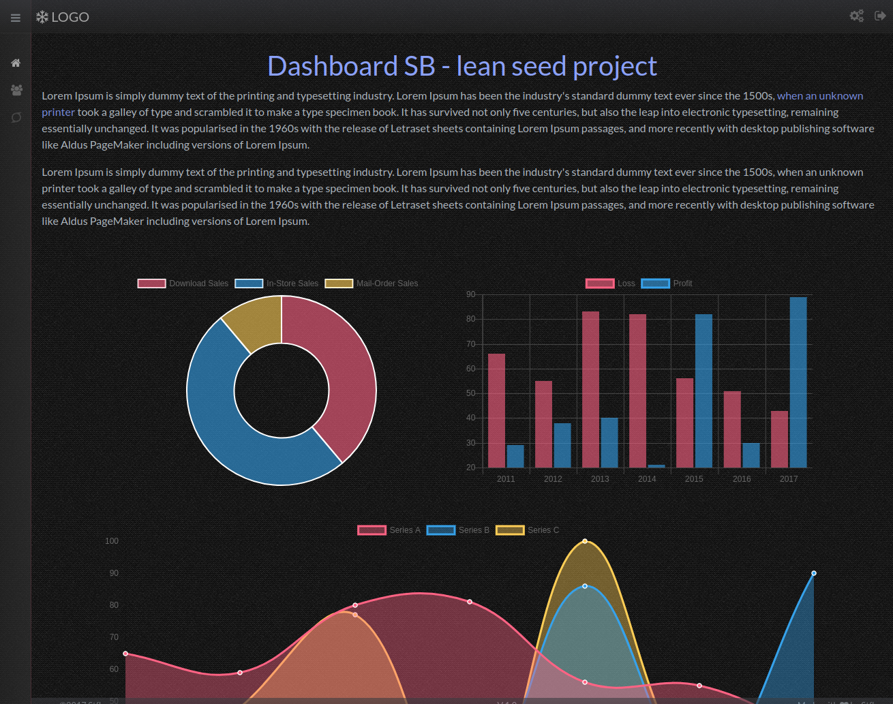

# DashboardSB

There is a lot of angular dashboard seed projects out there. But they are stuffed with a lot of things that might be not necessary to start a project of your own. So I decided to do my own Angular dashboard lean seed project.

This project was scaffolded with [Angular CLI](https://github.com/angular/angular-cli) version 1.4.9.

 

## What's included
- Angular 5+ & Typescript 2.6.2
- Bootstrap 4+ & SCSS
- Responsive design
- Font Awesome
- Dark theme

## Demo
[http://dashboard-sb.boyeau.com](http://dashboard-sb.boyeau.com)

## Setup
- clone repositiory
- npm i
- npm start (localhost and all IPs access)
- npm start-local (localhost access only)

Navigate to `http://localhost:4200/`. The app will automatically reload if you change any of the source files.

## News
- 2018-02-10 - Updated to Angular 5
- 2017-11-26 - Initial commit

## Code scaffolding

To generate a new page, for example a Login page:
- Execute this:

`cd src/app/pages`
`ng generate module login --routing`
`ng generate component login`

- add the necessary route to the login-routing.module:

`{
    path: '',
    component: LoginComponent
 }`

Don't forget to import the LoginComponent into the login-routing.module.

- add the new route to the app-routing.module:

 ` {
    path: 'login',
    loadChildren: 'app/pages/login/login.module#LoginModule'
  }`

  Got to `http://localhost:4200/#/login`. The login component content should show up on the content part of the page. 

## Build

Run `ng build` to build the project. The build artifacts will be stored in the `dist/` directory. Use the `-prod` flag for a production build.

## Running unit tests

Run `ng test` to execute the unit tests via [Karma](https://karma-runner.github.io).

## Running end-to-end tests

Run `ng e2e` to execute the end-to-end tests via [Protractor](http://www.protractortest.org/).

## Further help

To get more help on the Angular CLI use `ng help` or go check out the [Angular CLI README](https://github.com/angular/angular-cli/blob/master/README.md).
